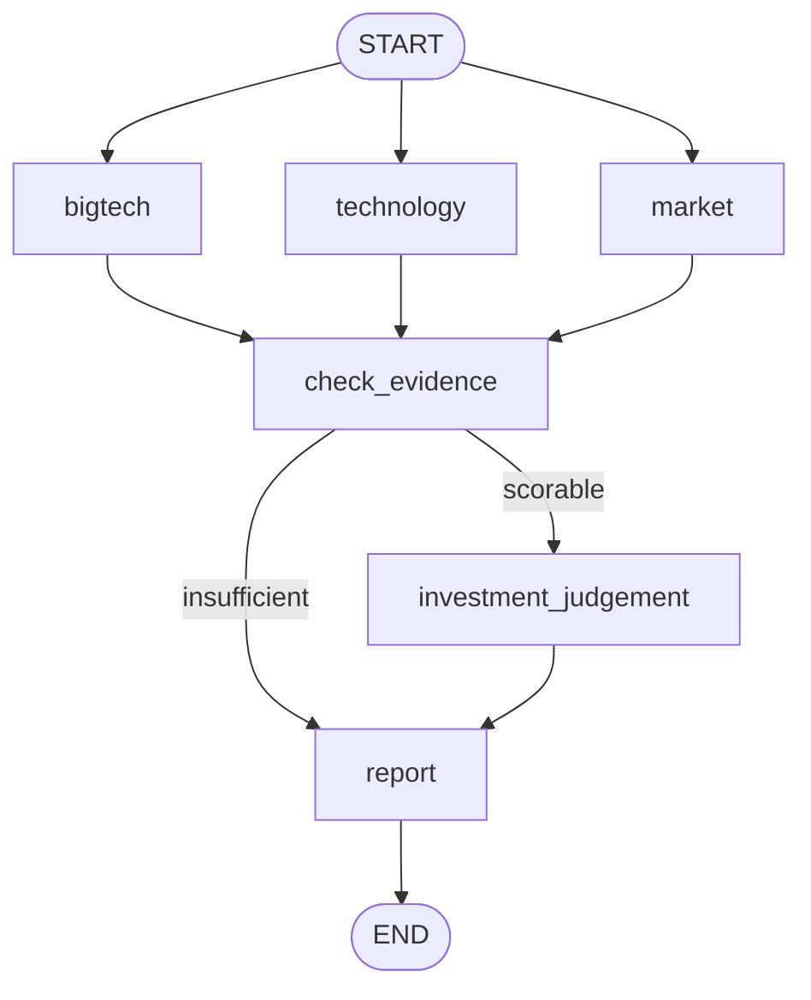

# Physical AI Startup Investment Evaluation Agent

**한 기업의 휴머노이드 사업화 근거를 문서·페이지 단위로 확인하고 투자 검토 보고서를 생성하는 LangGraph 기반 RAG 프로젝트**

평가 대상은 **MOTOMIND, ROBROS, Figure AI**입니다. 그래프는 한 번에 한 기업을 평가하며, `run_reports.py`는 세 기업을 차례로 실행합니다. 기업 간 투자 순위는 만들지 않습니다.

**빠른 실행:** 저장소 루트에서 의존성을 설치하고 `.env`에 `OPENAI_API_KEY`를 설정한 뒤 `python run_reports.py`를 실행합니다. 자세한 절차는 [Usage](#usage)를 참고하세요.

## Overview — 문제 정의

휴머노이드의 시연 성능이나 유명 기업과의 접점만으로 사업화 가능성을 판단하기는 어렵습니다. 연구실 성능과 실제 현장 운영은 다르고, 투자·공동개발·시험·구매는 서로 다른 단계입니다. 본 프로젝트는 공개 자료에서 **확인된 관계의 종류와 단계**를 구분하고, 근거가 부족한 항목은 낮은 점수 대신 `U(미확인)`로 남깁니다.

- **입력:** 평가할 기업명 한 곳과 문서 카탈로그
- **처리:** PDF 검색 → 빅테크·기술·시장 분석 → 원본 근거 검사 → 투자 판단 → 보고서
- **출력:** 해당 기업의 근거 문서·페이지, 항목별 점수와 미확인 항목을 포함한 보고서

## Differentiation — 빅테크 연관성의 단계별 검증

우리 조의 핵심 차별점은 **“어느 빅테크와 관련 있는가?”보다 “무슨 관계가 어디까지 확인됐는가?”**를 묻는 것입니다. 빅테크 이름이 등장했다는 이유만으로 가점을 주지 않습니다.

| 확인된 관계 | 평가할 때 구분하는 내용 |
|---|---|
| 지분·CVC 투자 | 실제 지분투자인지, 단순 행사·지원·협력인지 |
| MOU·공동개발 | 협력 의사인지, 제품의 실제 사용인지 |
| 현장 실증 | 고객 현장 시험인지, 유상 계약·매출인지 |
| 유상 계약·납품 | 구매·상용 사용이 확인됐는지 |
| 재구매·계약 확대 | 최초 계약 이후 반복 수요가 확인됐는지 |

100점 Scorecard 중 **실적 영역은 20점**입니다. 이 안에서 `대기업 실제 지분·CVC 투자`에 **4점**, `대기업 계약·납품 단계`에 **6점**을 배정했습니다. 계약·납품 단계는 관계 없음이 확인된 경우 0등급, MOU 1등급, 현장 실증 2등급, 유상 계약·상용 납품 3등급, 유상 확대·갱신 검증 4등급으로 구분합니다. 등급의 환산점수는 `항목 배점 × 등급 ÷ 4`입니다. **확인 불가(`U`)는 0등급과 다릅니다.**

## Features

- PDF를 원본 페이지별 `Document`로 파싱하고 문서 ID·기업·페이지를 보존합니다.
- 세 RAG 분석 노드가 빅테크 관계, 기술·현장 적용, 시장성·경쟁을 각각 조사합니다.
- `check_evidence`가 주장에 연결된 PDF 페이지와 원문 인용을 대조합니다.
- LLM은 21개 평가 항목의 등급과 이유를 제안하고, 코드는 근거 ID와 배점을 검사·계산합니다.
- 보고서는 검증된 주장을 배치하고 Scorecard와 실제 인용한 자료의 위치를 표시합니다.

## Agents & Architecture

| 노드 | RAG | 역할과 주요 출력 |
|---|:---:|---|
| `bigtech` | O | 투자·MOU·현장 실증·유상 계약·재구매 관계와 문서·페이지 |
| `technology` | O | 팀·제품·핵심 작업 성능·안전성·양산 관련 주장 |
| `market` | O | 수요·시장 진입·경쟁력 관련 주장. 기업 자료와 공통 시장 자료 검색 |
| `check_evidence` | — | 원본 페이지와 주장을 대조해 검증된 주장과 근거 부족 주장을 분리 |
| `investment_judgement` | X | 검증된 근거로 등급을 제안받고 고정 Scorecard로 점수·판정 계산 |
| `report` | X | 검증된 주장 ID를 섹션에 배치하고 보고서·점수표·참고문헌 작성 |



세 분석 노드는 병렬로 실행됩니다. 검증 가능한 기술 근거가 없으면 투자 점수 산정을 건너뛰지만, **부족한 근거를 표시한 보고서**는 생성합니다.

## Data, Retrieval & Embedding

`data/catalog.csv`에 등록된 자료는 **22건·106페이지**로, 과제의 총 200페이지 상한 이내입니다.

| 기업·자료군 | 문서 수 |
|---|---:|
| MOTOMIND | 6 |
| ROBROS | 6 |
| Figure AI | 6 |
| 공통 시장 자료 | 4 |

페이지 경계를 넘지 않도록 기본 **1,000자 청크·150자 중첩**으로 분할합니다. 오픈소스 다국어 임베딩 모델 **`BAAI/bge-m3`**로 문서와 질의를 벡터화한 뒤, NumPy 메모리 인덱스에서 정규화 벡터의 유사도를 비교합니다. 기본 검색 개수는 `k=4`입니다. 한국어·영어가 혼합된 자료를 한 모델로 검색하기 위한 선택이며, 별도 VectorDB를 사용하지 않습니다.

> Hit Rate@K·MRR 등의 검색 성능 수치는 이 저장소에서 측정 결과가 확인되기 전까지 기재하지 않습니다. 회사 자체 발표와 고객사·투자사 확인 자료도 동일한 수준의 독립 근거로 취급하지 않습니다.

## Evidence-to-Decision — 실제 실행 결과

`run_reports.py`로 세 기업을 각각 실행해 생성한 **초안 결과**입니다. 숫자는 확인된 항목만 합산한 값이며, 미확인 배점을 0점으로 취급하거나 100점으로 환산하지 않습니다. `output/figure_ai_test_report.md`는 별도의 테스트 입력 예시입니다.

| 기업 | 확인된 점수 / 평가 가능 배점 | 미확인 배점 | 출력 판정 |
|---|---:|---:|---|
| MOTOMIND | 17.5 / 22 | 78 | 근거 부족 |
| ROBROS | 19.5 / 26 | 74 | 근거 부족 |
| Figure AI | 24 / 33 | 67 | 근거 부족 |

Figure AI에서 빅테크·대기업 연관성 검증 흐름은 다음과 같습니다.

| 단계 | 생성된 결과와 근거 |
|---|---|
| 원본 문서 | BMW 공장 내 Figure 03 시연: `figure_f03_at_bmw.pdf` p.3 [E1]; Catalyst 현장 통합: `figure_catalyst_brands.pdf` p.2 [E2]; Brookfield 투자 언급: 같은 문서 p.2 [E3] |
| 관계 유형 | BMW·Catalyst **현장 실증**, Brookfield **투자**. 현장 실증만으로 유상 매출이나 재구매를 인정하지 않음 |
| Scorecard 반영 | `대기업 실제 지분·CVC 투자` 4/4점, `대기업 계약·납품 단계` 3/6점 |
| 최종 출력 | 확인된 점수 24/33점, 미확인 배점 67점 → **근거 부족** |

**검수 메모:** `figure_catalyst_brands.pdf` p.1에는 Catalyst Brands와의 **상업 계약 발표**가 있지만, 공개 자료만으로 유상 매출·납품·재구매를 확인할 수는 없습니다. 생성 보고서는 이 항목들을 `U`로 남겼습니다. 회사 발표에 의존한 주장과 미확인 항목이 많으므로 현재 점수는 **최종 투자 결론이 아닌 공개 자료 기반 초안**입니다.

## Investment Report Highlights

보고서는 입력한 **한 기업**을 대상으로 다음 다섯 구역을 만듭니다.

1. SUMMARY + 기업 개요
2. 시장·팀 분석
3. 기술·경쟁력·실적
4. 리스크 + 투자평가
5. 실제 인용한 자료의 문서 위치·페이지

- **핵심 투자 포인트:** Figure AI는 BMW·Catalyst 현장 실증과 Brookfield 투자 관계를 문서·페이지로 추적할 수 있습니다.
- **핵심 리스크:** 세 기업 모두 미확인 배점이 크고, 현장 실증에서 유상 매출·재구매로 이어졌는지는 추가 확인이 필요합니다.
- **최종 의견:** 현재 세 보고서 모두 `근거 부족`입니다. 기업 간 순위나 투자 확정 결론으로 해석하지 않습니다.

점수의 분모를 임의로 100점으로 재환산하지 않습니다. `U` 항목이 많으면 확인된 점수와 함께 **미확인 배점**을 반드시 제시합니다.

## Lessons Learned & Limitations

- **자료 없음 ≠ 0점:** 공개 자료로 확인할 수 없는 관계나 실적은 `U`로 남겨 부재가 입증된 경우와 구분했습니다.
- **인용 위치 ≠ 주장 입증:** LLM이 제시한 문서 ID·페이지가 존재해도, 원본 페이지가 실제 주장을 뒷받침하는지 다시 확인해야 했습니다.
- **LLM 등급 ≠ 최종 점수:** 잘못된 평가 항목명이나 근거 없는 등급은 점수에 반영하지 않고 `U`로 처리하도록 했습니다.
- **공개 자료의 한계:** 비공개 계약금액, 투자조건, 재구매 여부와 회사 자체 발표의 독립 검증 여부는 추가 확인이 필요합니다.

---

## Tech Stack

| 영역 | 구현 |
|---|---|
| Workflow | LangGraph |
| LLM | OpenAI (`OPENAI_MODEL`, 기본값 `gpt-4.1-mini`) |
| PDF parsing | pdfplumber, LangChain `Document` |
| Embedding | `BAAI/bge-m3` (`sentence-transformers`) |
| Retrieval | NumPy 기반 메모리 dense 유사도 검색 |
| Report | 검증 근거 ID 분류, Markdown 생성, PDF 변환 |

## Directory Structure

```text
data/raw/          기업·공통 자료 PDF
data/catalog.csv   문서 ID, 출처, 파일 경로, 페이지 정보
PDF/pdf_loader.py  페이지별 PDF 파싱
retrieval.py       청킹·임베딩·검색
analyses.py        빅테크·기술·시장 분석
workflow.py        근거 검사·투자 판단
scorecard.py       21개 평가 항목과 점수 계산
report.py          단일 기업 Markdown 보고서
pdf_export.py      Markdown → PDF 변환
graph.py           LangGraph 연결과 State
run_reports.py     세 기업을 차례로 실행하는 스크립트
tests/             구성 요소·Graph 테스트
output/reports/    생성된 기업별 Markdown·PDF 보고서
```

## Usage

```bash
python3 -m venv .venv
source .venv/bin/activate
pip install -r requirements.txt
cp .env.example .env
```

`.env`에 `OPENAI_API_KEY`를 설정한 뒤 저장소 루트에서 실행합니다. 첫 실행 시 BGE-M3 모델 로드와 PDF 인덱스 구축에 시간이 걸릴 수 있습니다.

```bash
python run_reports.py
```

스크립트는 그래프를 기업별로 한 번씩 호출하고 `output/reports/`에 Markdown과 PDF를 저장합니다. 현재 `run_reports.py`에는 **테스트용 판정 기준**(최소 70점, 필수 항목 `핵심 작업 성능`)이 설정돼 있습니다. 발표·최종 평가에는 팀이 합의한 기준인지 확인한 뒤 사용해야 합니다. 한글 PDF 폰트를 자동으로 찾지 못하면 `RAG_PDF_FONT`에 사용 가능한 TTF 경로를 지정합니다.

## Tests

```bash
PYTHONPATH=.:PDF python -m pytest -q
```

테스트는 PDF 로딩·카탈로그 검증·기업별 검색·분석 결과 형식·근거 검사·Scorecard·Graph 분기·보고서 생성을 다룹니다. README의 실제 투자 결과는 테스트 픽스처와 구분합니다.

## Contributors

| 팀원 | 담당 |
|---|---|
| [이상수] | 원문 자료 조사·카탈로그 |
| [우강산] | PDF 파싱 |
| [정지영] | 임베딩·검색 |
| [박소정] | 빅테크·기술·시장 분석 |
| [김재혁] | 근거 검사·투자 판단·보고서·Graph 연결 |
